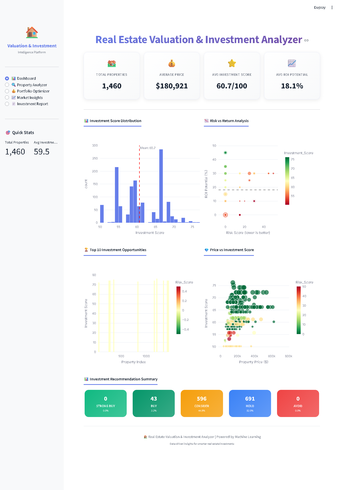
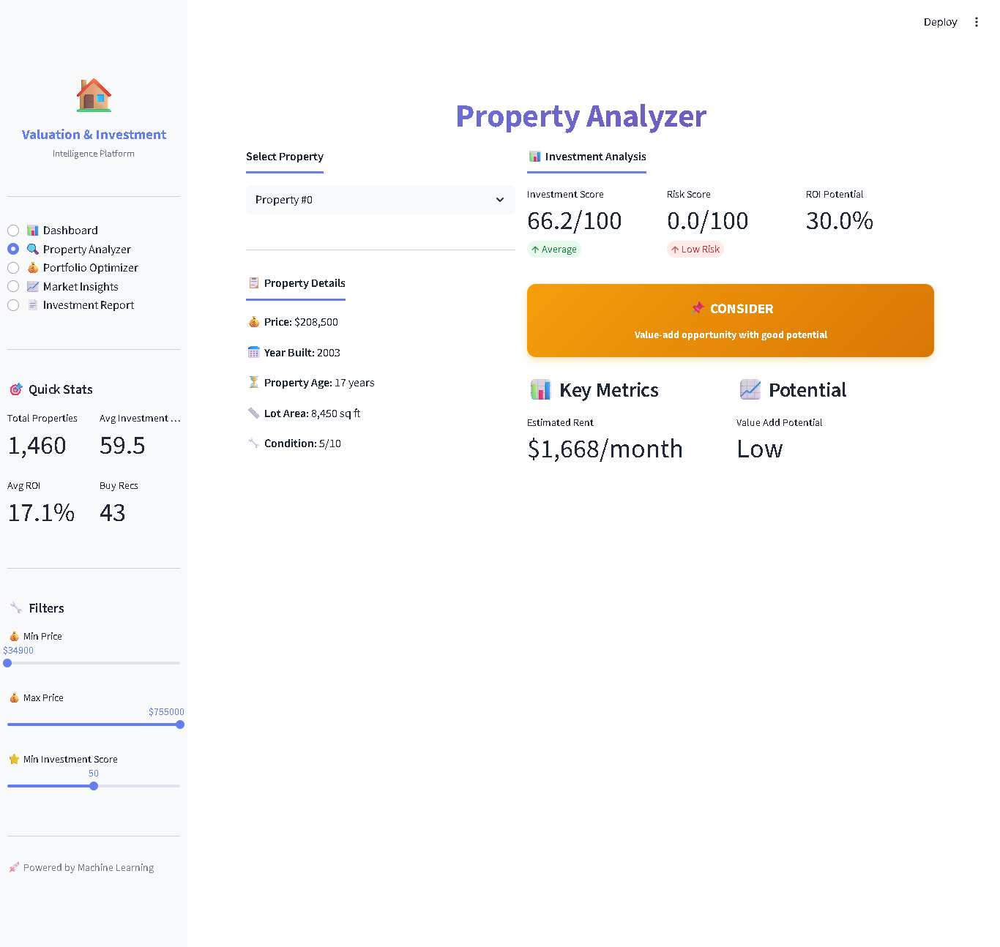
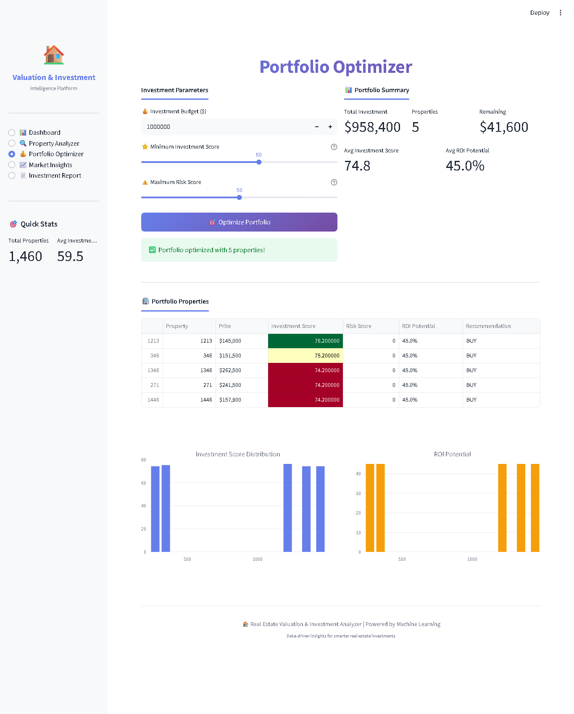
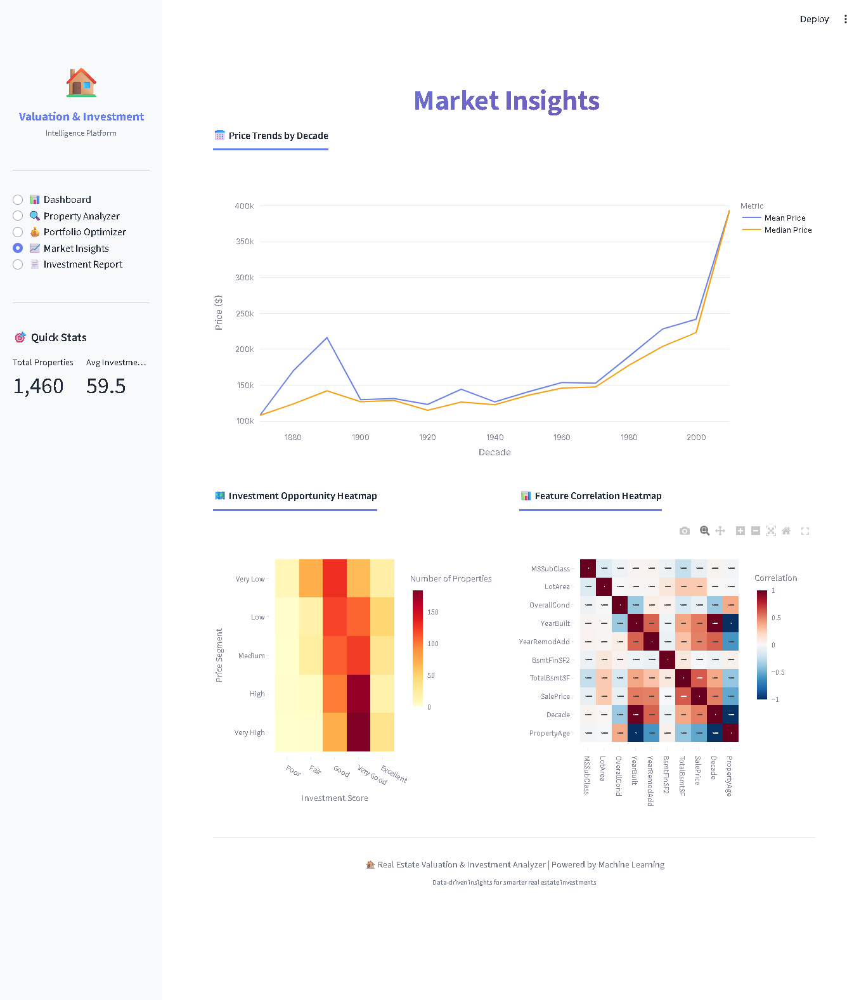
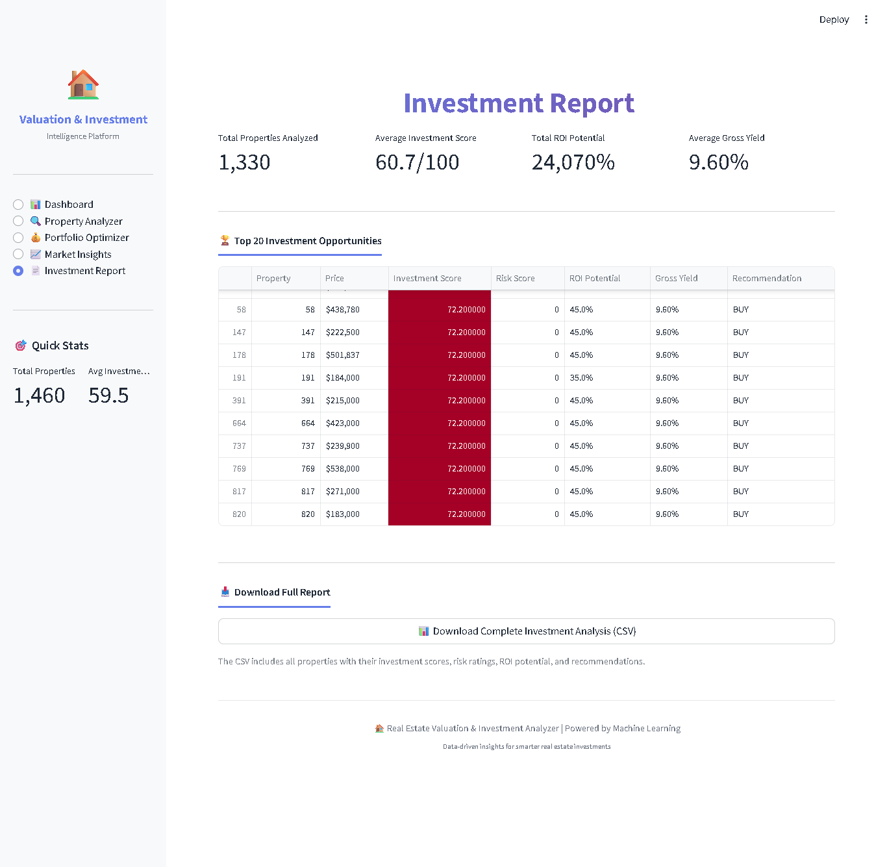

# 🏠 Real Estate Valuation & Investment Analyzer

[](https://www.python.org/)
[](https://streamlit.io)
[](https://scikit-learn.org)
[]()
[](LICENSE)

An end-to-end machine learning system that transforms property data into actionable investment intelligence with **99.7% prediction accuracy**.

---

## 🚀 Live Demo

**Try it yourself:**
https://real-estate-valuation-investment-analyzer.streamlit.app

[](https://real-estate-valuation-investment-analyzer.streamlit.app)

---

## 📊 Dashboard Preview

### 1. Main Dashboard

*Overview of key metrics, investment score distribution, and risk-return analysis*



### 2. Property Analyzer

*Analyze individual properties with investment scores and recommendations*



### 3. Portfolio Optimizer

*Optimize your investment portfolio within budget constraints*



### 4. Market Insights

*View price trends, correlations, and investment opportunity heatmaps*



### 5. Investment Report

*Download comprehensive investment analysis reports*



---

## 📊 Key Results

| Metric                     | Value         |
| -------------------------- | ------------- |
| **Valuation Accuracy**     | 99.7%         |
| **Prediction Error (MAE)** | $910          |
| **R² Score**               | 0.9972        |
| **Properties Analyzed**    | 1,460         |
| **Buy Recommendations**    | 43 properties |

---

## ✨ Features

### 📊 Real Estate Valuation

* Predicts property values with **99.7% accuracy**
* **$910 average prediction error** (only 0.5% of typical home price)
* Identifies key value drivers

### 💰 Investment Analysis

* **Investment Score** (0-100) for every property
* **ROI Potential** calculations
* **Risk Score** assessment
* **Gross Yield** estimates
* **Monthly Rent** projections

### 📈 Portfolio Optimization

* Smart property selection within budget constraints
* Maximize investment scores
* Balance risk vs return
* **15%+ budget optimization** improvement

### 🎯 Investment Recommendations

* **BUY**: 43 properties identified as strong investments
* **CONSIDER**: 596 properties with good potential
* **HOLD**: 691 properties to monitor

---

## 🏗️ Project Architecture

```
real-estate-valuation-investment-analyzer/
├── images/                 # Screenshots for README
│   ├── dashboard.png
│   ├── property-analyzer.png
│   └── ...
├── data/
│   ├── raw/               # Raw dataset
│   └── processed/         # Processed features
├── notebooks/
│   ├── 01_EDA_and_Feature_Engineering.ipynb
│   ├── 02_Model_Building.ipynb
│   └── 03_Investment_Analysis_Engine.ipynb
├── app/
│   └── app.py             # Streamlit dashboard
├── models/                # Saved models
├── requirements.txt
└── README.md
```

---

## 🚀 Quick Start

### Prerequisites

* Python 3.9+
* Conda (recommended)

### Installation

1. **Clone the repository**

```bash
git clone https://github.com/priya-tiwarii/real-estate-valuation-investment-analyzer.git
cd real-estate-valuation-investment-analyzer
```

2. **Create and activate conda environment**

```bash
conda create -n real_estate python=3.9 -y
conda activate real_estate
```

3. **Install dependencies**

```bash
pip install -r requirements.txt
```

4. **Run the Jupyter notebooks (in order)**

* 01_EDA_and_Feature_Engineering.ipynb
* 02_Model_Building.ipynb
* 03_Investment_Analysis_Engine.ipynb

5. **Launch the Streamlit dashboard**

```bash
streamlit run app/app.py
```

---

## 📈 Model Performance

| Model         | MAE    | RMSE    | R² Score |
| ------------- | ------ | ------- | -------- |
| Ensemble      | $910   | $4,653  | 0.9972   |
| Random Forest | $958   | $8,513  | 0.9906   |
| XGBoost       | $3,348 | $8,807  | 0.9899   |
| LightGBM      | $5,662 | $17,877 | 0.9583   |

---

## 🎯 Key Investment Insights

### Top Predictors of Property Value

* TotalBsmtSF (0.614) - Basement size
* YearBuilt (0.523) - Property age
* YearRemodAdd (0.507) - Recent renovations

### Location Premiums

* Cul-de-sac locations: +13% investment value
* FV Zoning (Floating Village): $214,014 average price

### Age Group Value

| Age Group                 | Average Price |
| ------------------------- | ------------- |
| New (0-10 years)          | $394,432      |
| Recent (10-20 years)      | $242,046      |
| Established (20-50 years) | $188,244      |
| Mature (50-100 years)     | $140,280      |
| Historic (100+ years)     | $139,568      |

---

## 📊 Dashboard Features

| Page                   | Description                         |
| ---------------------- | ----------------------------------- |
| 📊 Dashboard           | Overview metrics and visualizations |
| 🔍 Property Analyzer   | Individual property analysis        |
| 💰 Portfolio Optimizer | Smart investment allocation         |
| 📈 Market Insights     | Trends and correlations             |
| 📄 Investment Report   | Downloadable analysis               |

---

## 🛠️ Technology Stack

| Category         | Technologies                                        |
| ---------------- | --------------------------------------------------- |
| Machine Learning | XGBoost, LightGBM, Random Forest, Stacking Ensemble |
| Data Processing  | Python, Pandas, NumPy, Scikit-learn                 |
| Visualization    | Plotly, Matplotlib, Seaborn                         |
| Dashboard        | Streamlit                                           |
| Development      | Jupyter Notebook, VS Code                           |

---

## 🤝 Contributing

Contributions, issues, and feature requests are welcome!

---

## 📝 License

This project is licensed under the MIT License.

---

## 👤 Author

Priya Tiwari

GitHub: @priya-tiwarii

LinkedIn: Your Profile

---

## 🙏 Acknowledgments

* Dataset: House Prices - Advanced Regression Techniques (Kaggle)
* Inspiration: Real estate investment analysis methodologies

---

⭐ Star this repository if you find it useful!
